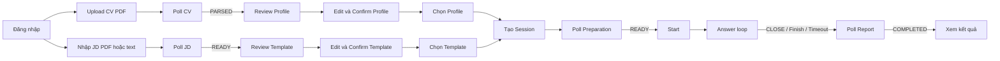

# API handoff cho frontend

Thư mục này là contract tích hợp frontend của backend `my-interview`. Nội dung đã được đối chiếu trực tiếp với controller, DTO, validation, security và service hiện tại. Khi giao việc cho một frontend AI agent, hãy gửi **toàn bộ thư mục `docs`** và yêu cầu đọc file này trước.

## Bản đồ tài liệu

| File | Phạm vi |
|---|---|
| [api-conventions.md](./api-conventions.md) | Base URL, auth header/cookie, format lỗi, refresh token, retry và quy ước dữ liệu chung |
| [auth-api.md](./auth-api.md) | Đăng ký, đăng nhập mật khẩu/Google, lấy user hiện tại, refresh, logout |
| [cv-profile-api.md](./cv-profile-api.md) | **Một luồng CV + Candidate Profile**: upload, poll parse, review/edit, confirm |
| [jd-template-api.md](./jd-template-api.md) | **Một luồng JD + Interview Template**: nhập JD, poll AI analysis, edit, confirm, publish |
| [interview-session-api.md](./interview-session-api.md) | Tạo session, chuẩn bị, phỏng vấn, retry answer, kết thúc, chấm điểm và report |
| [speech-api.md](./speech-api.md) | Push-to-talk STT, audio interviewer, cấu hình ElevenLabs và cách đổi speech provider |
| [realtime-api.md](./realtime-api.md) | Gemini Live grant, event/transcript, resume, fallback và browser client mẫu |
| [frontend-implementation-guide.md](./frontend-implementation-guide.md) | Kiến trúc client, route/screen, state machine, query invalidation và checklist hoàn thiện |
| [openapi.yaml](./openapi.yaml) | OpenAPI 3.0 để sinh type/client hoặc nạp vào công cụ API |
| [database-migrations.md](./database-migrations.md) | Cách Liquibase quản lý schema, tiếp quản database cũ và thêm migration mới |

## Luồng sản phẩm đầy đủ

Thứ tự API tối thiểu cho happy path:

1. `POST /api/auth/login` hoặc `/register` hoặc `/google`.
2. `POST /api/cvs` → poll `GET /api/cvs/{cvId}` đến `PARSED` → lấy `profileId`.
3. `GET /api/profiles/{profileId}` → `PUT` nếu cần → `POST /confirm`.
4. `POST /api/job-descriptions` bằng PDF hoặc text → poll `GET /api/job-descriptions/{id}` đến `READY` → lấy `templateId`.
5. `GET /api/interview-templates/{templateId}` → `PUT` nếu cần → `POST /confirm`.
6. `GET /api/interview-session-options` để render lựa chọn hợp lệ.
7. `POST /api/interview-sessions` với một `Idempotency-Key` mới → poll `GET /api/interview-sessions/{id}` đến `READY`.
8. `POST /api/interview-sessions/{id}/start`.
9. Lặp `POST /api/interview-sessions/{id}/answers`; mỗi câu trả lời có một `Idempotency-Key` riêng.
10. Khi session sang `SCORING`, poll `GET /api/interview-sessions/{id}/report` đến `COMPLETED`.

## Danh sách endpoint

| Method | Path | Auth | Kết quả chính |
|---|---|---|---|
| POST | `/api/auth/register` | Public | `201 AuthResponse` + refresh cookie |
| POST | `/api/auth/login` | Public | `200 AuthResponse` + refresh cookie |
| POST | `/api/auth/google` | Public | `200 AuthResponse` + refresh cookie |
| GET | `/api/auth/me` | Bearer | `200 CurrentUserResponse` |
| POST | `/api/auth/refresh` | Refresh cookie | `200 AuthResponse` + cookie mới |
| POST | `/api/auth/logout` | Cookie tùy chọn | `204`, xóa cookie |
| POST | `/api/auth/logout-all` | Bearer | `204`, thu hồi mọi refresh token |
| POST | `/api/cvs` | Bearer, role `USER` | `202` mới / `200` tái sử dụng |
| GET | `/api/cvs` | Bearer, role `USER` | Danh sách CV đang active |
| GET | `/api/cvs/{cvId}` | Bearer, role `USER` | Trạng thái parse và profile liên kết |
| GET | `/api/cvs/{cvId}/file` | Bearer, role `USER` | Presigned URL 5 phút |
| POST | `/api/cvs/{cvId}/parse` | Bearer, role `USER` | `202`, retry CV `FAILED` |
| DELETE | `/api/cvs/{cvId}` | Bearer, role `USER` | `204`, soft delete |
| GET | `/api/profiles` | Bearer, role `USER` | Danh sách profile của CV active |
| GET | `/api/profiles/{profileId}` | Bearer, role `USER` | Profile đầy đủ |
| PUT | `/api/profiles/{profileId}` | Bearer, role `USER` | Cập nhật toàn bộ profile |
| POST | `/api/profiles/{profileId}/confirm` | Bearer, role `USER` | Xác nhận profile dùng cho session |
| POST | `/api/job-descriptions` | Bearer | `202` mới / `200` tái sử dụng |
| GET | `/api/job-descriptions` | Bearer | Danh sách JD đang active |
| GET | `/api/job-descriptions/{id}` | Bearer | Trạng thái pipeline và template liên kết |
| GET | `/api/job-descriptions/{id}/file` | Bearer | Presigned URL 5 phút cho JD PDF |
| GET | `/api/job-descriptions/{id}/analysis` | Bearer | Text và kết quả AI bất biến |
| POST | `/api/job-descriptions/{id}/retry` | Bearer | `202`, retry JD `FAILED` |
| DELETE | `/api/job-descriptions/{id}` | Bearer | `204`, soft delete |
| GET | `/api/interview-templates` | Bearer | Danh sách `mine` hoặc `public`, có phân trang |
| GET | `/api/interview-templates/{id}` | Bearer | Template của mình hoặc public |
| PUT | `/api/interview-templates/{id}` | Bearer, owner | Sửa draft với optimistic version |
| POST | `/api/interview-templates/{id}/confirm` | Bearer, owner | Confirm và khóa nội dung |
| POST | `/api/interview-templates/{id}/publish` | Bearer, owner `ADMIN` | Công khai template đã confirm |
| POST | `/api/interview-templates/{id}/unpublish` | Bearer, owner `ADMIN` | Gỡ công khai |
| POST | `/api/interview-templates/{id}/archive` | Bearer, owner | Archive và tự unpublish |
| GET | `/api/interview-session-options` | Bearer | Ngôn ngữ, thời lượng, style hợp lệ |
| POST | `/api/interview-sessions` | Bearer | `202`, tạo và chuẩn bị session |
| GET | `/api/interview-sessions/{id}` | Bearer, owner | Trạng thái session |
| POST | `/api/interview-sessions/{id}/preparation/retry` | Bearer, owner | `202`, retry preparation |
| POST | `/api/interview-sessions/{id}/start` | Bearer, owner | Bắt đầu và trả conversation |
| GET | `/api/interview-sessions/{id}/conversation` | Bearer, owner | Khôi phục toàn bộ hội thoại |
| POST | `/api/interview-sessions/{id}/answers` | Bearer, owner | Lưu answer và đợi AI reply |
| POST | `/api/interview-sessions/{id}/speech/transcriptions` | Bearer, owner | Chuyển audio ứng viên thành text |
| POST | `/api/interview-sessions/{id}/speech/turns/{turnId}/audio` | Bearer, owner | Tạo hoặc lấy MP3 cho interviewer turn |
| POST | `/api/interview-sessions/{id}/realtime/session-grants` | Bearer, owner | Cấp ephemeral token và WebSocket setup cho voice realtime |
| POST | `/api/interview-sessions/{id}/realtime/connections/{connectionId}/events` | Bearer, owner | Lưu event/transcript idempotent và tạo interview turn |
| POST | `/api/interview-sessions/{id}/realtime/connections/{connectionId}/resume-grants` | Bearer, owner | Cấp token mới từ resumption handle |
| POST | `/api/interview-sessions/{id}/realtime/connections/{connectionId}/disconnect` | Bearer, owner | Lưu latency và tùy chọn fallback turn-based |
| POST | `/api/interview-sessions/{id}/finish` | Bearer, owner | Kết thúc sớm và chuyển scoring |
| GET | `/api/interview-sessions/{id}/report` | Bearer, owner | Trạng thái scoring hoặc report |
| POST | `/api/interview-sessions/{id}/scoring/retry` | Bearer, owner | `202`, retry scoring |

## Giới hạn contract frontend cần biết

- Backend hiện **không có API list interview sessions**. Frontend chỉ có thể mở lại session khi đã giữ `sessionId` cục bộ hoặc nhận ID từ nơi khác.
- CORS đã cho phép `Idempotency-Key`; production cần cấu hình đúng frontend origin bằng `CORS_ALLOWED_ORIGINS`.
- Không có endpoint cancel session `PREPARING`/`READY`, không có endpoint tạo profile thủ công khi chưa upload CV, và không có endpoint clone template đã confirm.
- Mọi API lấy resource theo ID đều kiểm tra owner hoặc visibility; frontend phải coi `404` là resource không tồn tại hoặc không có quyền xem, không suy luận owner từ ID.
