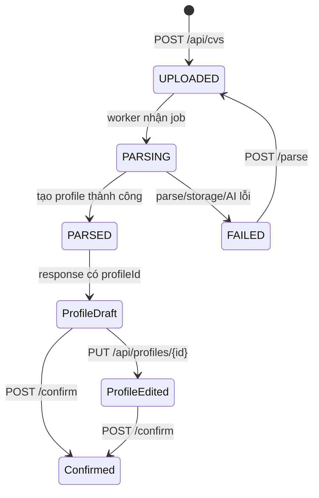

# CV + Candidate Profile API

CV và Profile là một luồng sản phẩm. CV là file nguồn và trạng thái xử lý; khi parse thành công, backend tự tạo đúng một Candidate Profile có thể chỉnh sửa và dùng làm snapshot cho interview.



Tất cả endpoint trong file này yêu cầu Bearer token và role `USER`.

## TypeScript contract

```ts
type CvDocumentStatus = "UPLOADED" | "PARSING" | "PARSED" | "FAILED";
type ProfileSource = "AUTO_PARSED" | "USER_EDITED";

interface CvDocument {
  id: number;
  originalFilename: string;
  contentType: string;
  fileSizeBytes: number;
  status: CvDocumentStatus;
  statusMessage: string | null;
  uploadedAt: string;
  parsedAt: string | null;
  profileId: number | null;
  profileConfirmed: boolean;
  profileHeadline: string | null;
}

interface FileUrlResponse {
  url: string;
  expiresAt: string;
}

interface ProfileSummary {
  id: number;
  version: number;
  name: string;
  cvDocumentId: number;
  cvOriginalFilename: string;
  headline: string | null;
  targetPosition: string | null;
  seniorityLevel: string | null;
  source: ProfileSource;
  confirmedAt: string | null;
  educationCount: number;
  skillCount: number;
  projectCount: number;
  createdAt: string;
  updatedAt: string;
}

interface ProfileEducation {
  id: number | null;
  school: string;
  degree: string | null;
  fieldOfStudy: string | null;
  startYear: number | null;
  endYear: number | null;
  userEdited: boolean | null;
  displayOrder: number | null;
}

interface ProfileSkill {
  id: number | null;
  name: string;
  category: string | null;
  userEdited: boolean | null;
  displayOrder: number | null;
}

interface ProfileProject {
  id: number | null;
  name: string;
  description: string | null;
  roleInProject: string | null;
  techStack: string | null;
  startDate: string | null; // YYYY-MM-DD
  endDate: string | null;   // YYYY-MM-DD
  userEdited: boolean | null;
  displayOrder: number | null;
}

interface CandidateProfile {
  id: number;
  version: number;
  name: string;
  cvDocumentId: number;
  cvOriginalFilename: string;
  headline: string | null;
  summary: string | null;
  yearsExperience: number | null;
  targetPosition: string | null;
  seniorityLevel: string | null;
  source: ProfileSource;
  confirmedAt: string | null;
  createdAt: string;
  updatedAt: string;
  educations: ProfileEducation[];
  skills: ProfileSkill[];
  projects: ProfileProject[];
}
```

## 1. Upload CV

```http
POST /api/cvs
Authorization: Bearer <accessToken>
Content-Type: multipart/form-data

file=<PDF binary>
```

Không tự đặt `Content-Type` khi dùng `FormData`:

```ts
const form = new FormData();
form.append("file", file);

await fetch(`${API_URL}/api/cvs`, {
  method: "POST",
  headers: { Authorization: `Bearer ${accessToken}` },
  body: form,
});
```

Input hiện tại:

- Có file, tên file kết thúc bằng `.pdf` không phân biệt hoa thường.
- Nội dung bắt đầu bằng PDF magic bytes và PDF mở được, không encrypted.
- Tối đa 5 MiB (`5,242,880` bytes), tối đa 10 trang.
- Một user giữ tối đa 10 CV active.

Response:

- `202 Accepted` khi tạo CV mới và bắt đầu parse nền.
- `200 OK` nếu checksum trùng một CV `PARSED` của cùng user. Backend dùng lại cả CV và profile đã chỉnh; nếu CV cũ bị soft-delete thì được active lại.

```json
{
  "id": 12,
  "originalFilename": "nguyen-van-an.pdf",
  "contentType": "application/pdf",
  "fileSizeBytes": 245120,
  "status": "UPLOADED",
  "statusMessage": null,
  "uploadedAt": "2026-09-07T08:00:00Z",
  "parsedAt": null,
  "profileId": null,
  "profileConfirmed": false,
  "profileHeadline": null
}
```

Worker có thể đổi status trước khi HTTP response được đọc. Luôn dùng `response.status`, không hard-code `UPLOADED` sau response `202`.

Lỗi upload: `CV_FILE_REQUIRED` (400), `CV_INVALID_FILE_TYPE` (415), `CV_FILE_TOO_LARGE` (413), `CV_FILE_CORRUPTED` (400), `CV_TOO_MANY_PAGES` (400), `CV_LIMIT_REACHED` (409), `STORAGE_UNAVAILABLE` (503).

## 2. Poll CV đến khi có Profile

```http
GET /api/cvs/{cvId}
Authorization: Bearer <accessToken>
```

| Status | UI/action |
|---|---|
| `UPLOADED`, `PARSING` | Hiện progress và tiếp tục poll |
| `PARSED` | Dừng poll; `profileId` phải có, chuyển sang review profile |
| `FAILED` | Dừng poll; hiện `statusMessage` và nút retry |

Khi `PARSED`:

```json
{
  "id": 12,
  "originalFilename": "nguyen-van-an.pdf",
  "contentType": "application/pdf",
  "fileSizeBytes": 245120,
  "status": "PARSED",
  "statusMessage": null,
  "uploadedAt": "2026-09-07T08:00:00Z",
  "parsedAt": "2026-09-07T08:00:09Z",
  "profileId": 35,
  "profileConfirmed": false,
  "profileHeadline": "Java Backend Developer"
}
```

`GET /api/cvs` trả `CvDocument[]`, mới nhất trước, chỉ gồm CV active. Dùng endpoint này cho trang CV/Profile overview và resume polling sau reload.

## 3. Retry CV thất bại

```http
POST /api/cvs/{cvId}/parse
Authorization: Bearer <accessToken>
```

Response `202 Accepted`, body `CvDocument`. Chỉ `FAILED` được retry. `UPLOADED/PARSING` trả `409 CV_PARSE_IN_PROGRESS`; `PARSED` trả `409 CV_PARSE_NOT_RETRYABLE`.

Sau retry tiếp tục poll `GET /api/cvs/{cvId}`. Response retry có thể đã chuyển tiếp khỏi `UPLOADED`.

## 4. Xem file CV

```http
GET /api/cvs/{cvId}/file
Authorization: Bearer <accessToken>
```

```json
{
  "url": "https://storage.example/...",
  "expiresAt": "2026-09-07T08:05:00Z"
}
```

URL hết hạn sau 5 phút. Chỉ fetch URL khi user mở preview; không cache lâu hơn `expiresAt`. Backend cho owner lấy URL bằng ID kể cả CV đã soft-delete, nhưng CV đã xóa không còn xuất hiện trong list/profile/session selection.

## 5. Lấy Profile để review

```http
GET /api/profiles/{profileId}
Authorization: Bearer <accessToken>
```

```json
{
  "id": 35,
  "version": 0,
  "name": "Java Backend Developer",
  "cvDocumentId": 12,
  "cvOriginalFilename": "nguyen-van-an.pdf",
  "headline": "Java Backend Developer",
  "summary": "Có kinh nghiệm xây REST API bằng Spring Boot.",
  "yearsExperience": 1.5,
  "targetPosition": "Backend Engineer",
  "seniorityLevel": "JUNIOR",
  "source": "AUTO_PARSED",
  "confirmedAt": null,
  "createdAt": "2026-09-07T08:00:09Z",
  "updatedAt": "2026-09-07T08:00:09Z",
  "educations": [
    {
      "id": 41,
      "school": "FPT University",
      "degree": "Bachelor",
      "fieldOfStudy": "Software Engineering",
      "startYear": 2021,
      "endYear": 2025,
      "userEdited": false,
      "displayOrder": 0
    }
  ],
  "skills": [
    {
      "id": 71,
      "name": "Java",
      "category": "LANGUAGE",
      "userEdited": false,
      "displayOrder": 0
    }
  ],
  "projects": []
}
```

`GET /api/profiles` trả `ProfileSummary[]`, mới nhất trước, chỉ gồm profile có CV active. Dùng `confirmedAt !== null` để lọc profile hợp lệ khi tạo interview.

## 6. Update Profile

```http
PUT /api/profiles/{profileId}
Authorization: Bearer <accessToken>
Content-Type: application/json
```

Đây là **full replacement** cho scalar fields và ba collection. Cách dựng payload an toàn:

1. Fetch `CandidateProfile` mới nhất.
2. Dùng đúng `version` vừa nhận.
3. Gửi lại toàn bộ `educations`, `skills`, `projects`, kể cả item không sửa.
4. Item cũ giữ `id`; item mới gửi `id: null`; item bị bỏ khỏi mảng sẽ bị xóa.
5. Thứ tự phần tử trong mảng quyết định `displayOrder`; input `displayOrder` bị bỏ qua.
6. `userEdited` do backend tính; input không quyết định giá trị lưu.

```json
{
  "version": 0,
  "name": "Backend profile 2026",
  "headline": "Java Backend Developer",
  "summary": "Có kinh nghiệm xây REST API bằng Spring Boot.",
  "yearsExperience": 1.5,
  "targetPosition": "Backend Engineer",
  "seniorityLevel": "JUNIOR",
  "educations": [
    {
      "id": 41,
      "school": "FPT University",
      "degree": "Bachelor",
      "fieldOfStudy": "Software Engineering",
      "startYear": 2021,
      "endYear": 2025,
      "userEdited": false,
      "displayOrder": 0
    }
  ],
  "skills": [
    {
      "id": 71,
      "name": "Java",
      "category": "LANGUAGE",
      "userEdited": false,
      "displayOrder": 0
    },
    {
      "id": null,
      "name": "Spring Boot",
      "category": "FRAMEWORK",
      "userEdited": true,
      "displayOrder": 1
    }
  ],
  "projects": []
}
```

Response `200 CandidateProfile`, thường có `version` tăng lên; luôn thay cache bằng response mới.

Validation:

| Field | Rule |
|---|---|
| `version` | Bắt buộc, số nguyên `>= 0` |
| `name` | Bắt buộc, tối đa 150 |
| `headline` | Tùy chọn, tối đa 255 |
| `summary` | Tùy chọn, tối đa 5000 |
| `yearsExperience` | Tùy chọn, `0..99.9`, tối đa 1 chữ số thập phân |
| `targetPosition` | Tùy chọn, tối đa 150 |
| `seniorityLevel` | Tùy chọn, tối đa 30; hiện là string tự do |
| `educations` | Bắt buộc, tối đa 20 item |
| `education.school` | Bắt buộc, tối đa 255 |
| `degree`, `fieldOfStudy` | Tùy chọn, tối đa 150 |
| `startYear`, `endYear` | Tùy chọn, 1900–2100; end >= start |
| `skills` | Bắt buộc, tối đa 100 item |
| `skill.name` | Bắt buộc, tối đa 80, không trùng nhau khi bỏ qua hoa/thường và khoảng trắng thừa |
| `skill.category` | Tùy chọn, tối đa 50; hiện là string tự do |
| `projects` | Bắt buộc, tối đa 50 item |
| `project.name` | Bắt buộc, tối đa 255 |
| `description` | Tùy chọn, tối đa 5000 |
| `roleInProject` | Tùy chọn, tối đa 150 |
| `techStack` | Tùy chọn, tối đa 500 |
| `startDate`, `endDate` | Tùy chọn ISO date; end >= start |

Lỗi đặc thù:

- `409 PROFILE_VERSION_CONFLICT`: dữ liệu đã được cập nhật ở nơi khác. Fetch lại và không tự ghi đè.
- `404 PROFILE_ITEM_NOT_FOUND`: một child `id` không thuộc profile hoặc xuất hiện hai lần.
- `409 DUPLICATE_SKILL_NAME`: trùng tên skill sau normalize.
- `404 PROFILE_NOT_FOUND`: profile không tồn tại, không thuộc user, hoặc CV đã bị soft-delete.

## 7. Confirm Profile

```http
POST /api/profiles/{profileId}/confirm
Authorization: Bearer <accessToken>
```

Không có body và không cần version. Response `200 CandidateProfile`; `confirmedAt` được đặt lần đầu. Gọi lại là idempotent và giữ nguyên timestamp.

Theo implementation hiện tại, profile **vẫn update được sau confirm** và vẫn giữ `confirmedAt`. Session mới sẽ snapshot dữ liệu profile tại thời điểm tạo session; session đã tạo không đổi theo các lần edit sau. Vì vậy frontend có thể cho phép sửa profile confirmed, nhưng phải báo rõ thay đổi chỉ áp dụng cho interview tạo sau đó.

## 8. Xóa CV và tác động lên Profile

```http
DELETE /api/cvs/{cvId}
Authorization: Bearer <accessToken>
```

Response `204 No Content`. Đây là soft delete:

- CV biến mất khỏi `GET /api/cvs`.
- Profile tương ứng biến mất khỏi `GET /api/profiles`, `GET/PUT/confirm profile` trả `PROFILE_NOT_FOUND`.
- Profile đó không thể dùng tạo session mới.
- Snapshot và file cần cho interview lịch sử vẫn được backend giữ.

Không thể xóa khi status `PARSING`: `409 CV_PARSE_IN_PROGRESS`.

