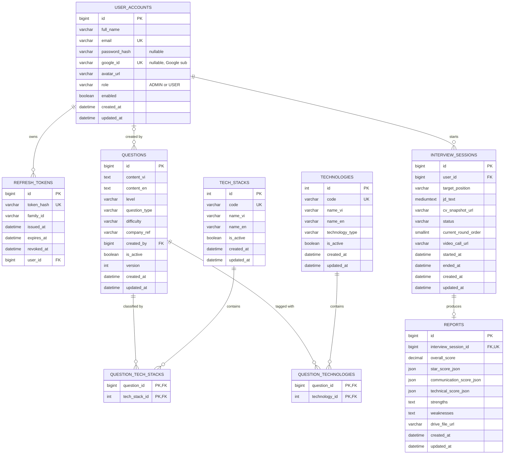
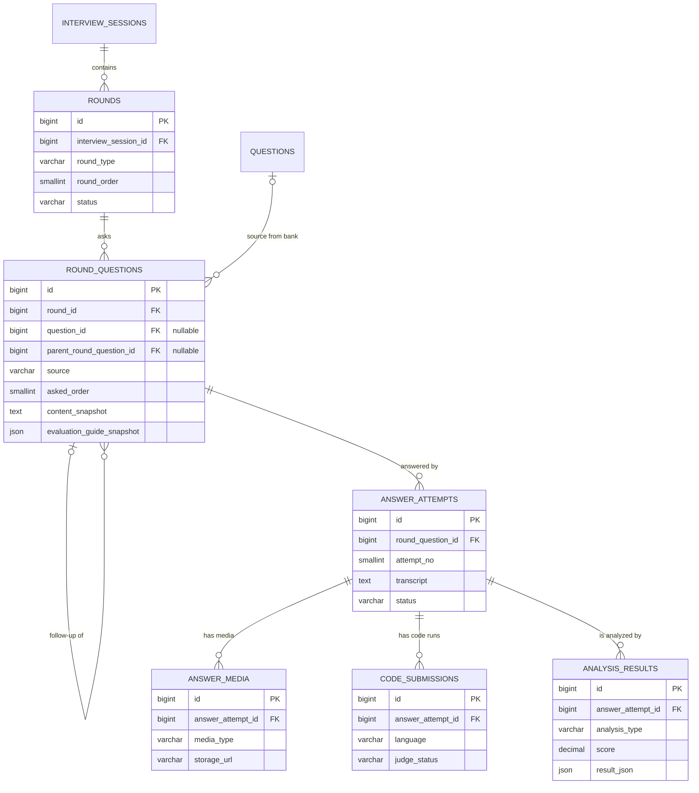

# ERD — Database hiện tại và kiến trúc mở rộng

> Nguyễn Xuân Tùng — US-04, US-10 và phần chuẩn bị US-11
> `user_accounts`, `refresh_tokens` do Thái Văn Trường phụ trách nhưng được thể hiện
> vì các bảng core tham chiếu đến tài khoản.

Các bảng trong sơ đồ trên được Liquibase quản lý ở Sprint 1. Sơ đồ kế tiếp là
phần thiết kế tổng thể của Round/Interview/Analysis để team thống nhất hướng mở
rộng; chúng **chưa phải bảng đã được master changelog tạo**.

Chi tiết snapshot, follow-up và nhiều lần trả lời nằm trong
`docs/database/round-module-design.md`.

## Giải thích thiết kế phân loại

- `tech_stacks` trả lời câu hỏi “thuộc mảng nào?”: Backend, Frontend, DevOps,
  Mobile, Data & AI, Testing.
- `technologies` trả lời câu hỏi “dùng công nghệ nào?”: Java, C#, Spring Boot,
  React, MySQL, Docker… Trường `technology_type` giúp frontend chia checkbox theo
  nhóm `LANGUAGE`, `FRAMEWORK`, `DATABASE`, `CLOUD`, `PLATFORM`, `TOOL`.
- `question_tech_stacks` và `question_technologies` dùng khóa chính kép để ngăn
  gắn trùng cùng một nhãn cho một câu hỏi.
- Không lưu danh sách id dưới dạng JSON/chuỗi trong `questions`, vì bảng nối bảo
  đảm khóa ngoại, truy vấn lọc/index tốt hơn và dễ mở rộng.
- Câu hỏi `TECHNICAL` phải có ít nhất một Tech Stack ở tầng service. Technology
  cụ thể là tùy chọn vì vẫn có câu hỏi kỹ thuật tổng quát.
- `content_vi`/`content_en` là ngôn ngữ hiển thị của nội dung; không dùng hai trường
  này để biểu diễn Java, C# hoặc ngôn ngữ lập trình khác.

## Các quyết định core giữ nguyên

- `user_accounts.email` là danh tính chung cho local login và Google login.
- `password_hash` có thể null với tài khoản chỉ dùng Google; `google_id` lưu OIDC `sub`.
- `questions.created_by` có thể null cho dữ liệu seed và dùng `ON DELETE SET NULL`.
- Reports phụ thuộc Interview Session nên dùng `ON DELETE CASCADE`.
- Round Module được thể hiện trong ERD tổng thể nhưng vẫn là deliverable thiết kế
  trong Sprint 1; chưa có migration/entity/API tương ứng.
