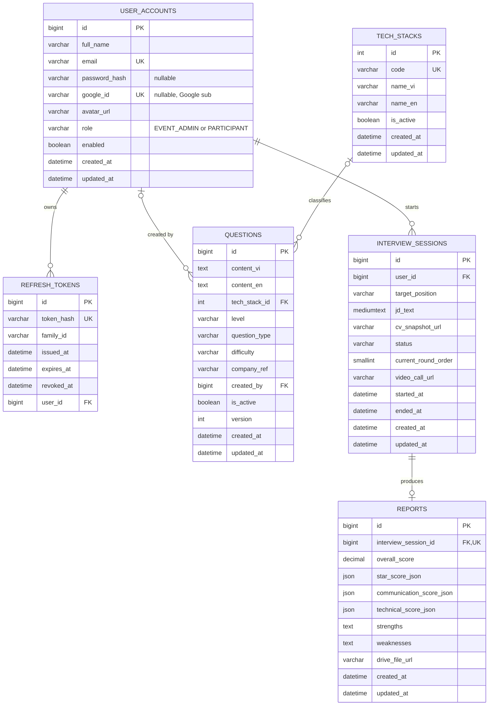

# ERD — Core Database — Sprint 1

> Nguyễn Xuân Tùng — Task 4.1 / US-04  
> Authentication tables (`user_accounts`, `refresh_tokens`) are owned by Thái Văn Trường
> and are included here because the core tables reference them.

## Decisions

- `user_accounts.email` is the common identity for local and Google login.
- `password_hash` is nullable for a Google-only account; `google_id` stores the immutable
  OpenID Connect `sub`. At least one login credential must be present.
- `questions.created_by` is nullable for system seed data and uses `ON DELETE SET NULL`.
- Deleting a user is restricted while interview history exists. Reports are dependent on
  their interview session and therefore use `ON DELETE CASCADE`.
- Round Module remains a design-only deliverable in Sprint 1.
