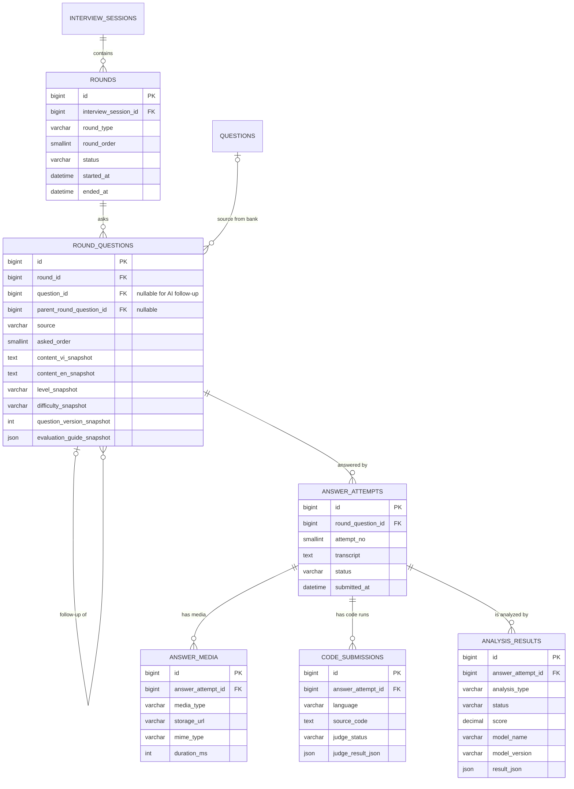

# Thiết kế Data Model — Round Module

> Người phụ trách: Nguyễn Xuân Tùng | Task 13.1 (US-13)
>
> Trạng thái Sprint 1: **thiết kế tổng thể, chưa tạo migration/entity/API cho Round**.
> Tài liệu này được đặt cạnh ERD core để team thấy trước cách Question Bank kết nối
> với Interview Engine, Judge0, media và Analysis Engine.

## 1. Mục tiêu

Một `interview_session` gồm nhiều vòng phỏng vấn. Mỗi vòng chứa các câu hỏi đã
được chọn hoặc được AI sinh động. Một câu hỏi có thể có nhiều lần trả lời và mỗi
lần trả lời có nhiều tài nguyên audio/video/code cũng như nhiều kết quả phân tích.

Thiết kế tách riêng bốn khái niệm:

1. `rounds`: cấu hình và trạng thái từng vòng.
2. `round_questions`: câu hỏi thực tế đã được hỏi trong một phiên.
3. `answer_attempts`: từng lần ứng viên gửi câu trả lời.
4. `answer_media`, `code_submissions`, `analysis_results`: dữ liệu phát sinh từ
   một lần trả lời.

Việc tách này tránh phải sửa `round_questions` khi triển khai US-16, US-17,
US-20, US-21 và US-22.

## 2. Sơ đồ quan hệ dự kiến



## 3. Các quyết định quan trọng

### 3.1 Question Bank và lịch sử phỏng vấn

`round_questions.question_id` tham chiếu Question Bank nếu câu hỏi đến từ ngân
hàng. Tuy nhiên các trường snapshot vẫn bắt buộc khi bắt đầu hỏi:

- `content_vi_snapshot`, `content_en_snapshot`;
- level, difficulty và version;
- evaluation guide/rubric đang được sử dụng.

Admin có thể sửa hoặc vô hiệu hóa Question Bank sau đó mà lịch sử phiên cũ vẫn
giữ đúng nội dung và tiêu chí đã dùng để đánh giá.

`question_id` có thể null với follow-up do AI sinh trực tiếp. Trường `source`
dự kiến nhận `QUESTION_BANK` hoặc `AI_FOLLOW_UP`.

### 3.2 Follow-up động

`parent_round_question_id` tạo cây hội thoại trong cùng vòng. Câu follow-up không
phải ghi ngược vào Question Bank và không làm thay đổi câu hỏi gốc.

### 3.3 Nhiều lần trả lời

Không lưu transcript/audio/video trực tiếp trong `round_questions`. Một câu hỏi
có thể có nhiều `answer_attempts`; khóa unique `(round_question_id, attempt_no)`
giữ thứ tự thử lại rõ ràng.

### 3.4 Media, Judge0 và Analysis

- `answer_media` chứa metadata và URL; file thật nằm ở object storage/Drive.
- `code_submissions` thuộc một answer attempt và có thể chứa nhiều lần chạy Judge0.
- `analysis_results` cho phép cùng một câu trả lời được phân tích nhiều loại:
  `SPEECH`, `BODY_LANGUAGE`, `STAR`, `TECHNICAL`, `CODE`.
- `model_name` và `model_version` giúp truy vết kết quả khi model/rubric thay đổi.
- `reports` hiện tại tiếp tục là bản tổng hợp cuối phiên, không thay thế dữ liệu
  chi tiết theo câu trả lời.

### 3.5 Trạng thái

Các trạng thái workflow dùng `VARCHAR` trong MySQL và enum/state machine ở Java.
Điều này phù hợp với changeset 017 của `interview_sessions.status` và tránh phải
ALTER TABLE mỗi lần US-19 bổ sung một trạng thái hợp lệ.

## 4. SQL nháp cho Sprint sau

Đây chỉ là hướng dẫn thiết kế, **không được đưa trực tiếp vào master changelog ở
Sprint 1**. Khi triển khai, chia thành nhiều changeset nhỏ để rollback và review dễ.

```sql
CREATE TABLE rounds (
    id                    BIGINT UNSIGNED AUTO_INCREMENT PRIMARY KEY,
    interview_session_id BIGINT UNSIGNED NOT NULL,
    round_type            VARCHAR(30) NOT NULL,
    round_order           SMALLINT UNSIGNED NOT NULL,
    status                VARCHAR(30) NOT NULL DEFAULT 'PENDING',
    started_at            DATETIME(6) NULL,
    ended_at              DATETIME(6) NULL,
    created_at            DATETIME(6) NOT NULL DEFAULT CURRENT_TIMESTAMP(6),
    updated_at            DATETIME(6) NOT NULL DEFAULT CURRENT_TIMESTAMP(6)
                                      ON UPDATE CURRENT_TIMESTAMP(6),

    CONSTRAINT fk_rounds_session
        FOREIGN KEY (interview_session_id) REFERENCES interview_sessions (id)
        ON DELETE CASCADE ON UPDATE RESTRICT,
    CONSTRAINT uq_round_order UNIQUE (interview_session_id, round_order),
    CONSTRAINT chk_round_order CHECK (round_order > 0),
    CONSTRAINT chk_round_time CHECK (
        ended_at IS NULL OR (started_at IS NOT NULL AND ended_at >= started_at)
    )
) ENGINE=InnoDB DEFAULT CHARSET=utf8mb4 COLLATE=utf8mb4_unicode_ci;

CREATE TABLE round_questions (
    id                        BIGINT UNSIGNED AUTO_INCREMENT PRIMARY KEY,
    round_id                  BIGINT UNSIGNED NOT NULL,
    question_id               BIGINT UNSIGNED NULL,
    parent_round_question_id  BIGINT UNSIGNED NULL,
    source                    VARCHAR(30) NOT NULL,
    asked_order               SMALLINT UNSIGNED NOT NULL,
    content_vi_snapshot       TEXT NOT NULL,
    content_en_snapshot       TEXT NULL,
    level_snapshot            VARCHAR(20) NULL,
    difficulty_snapshot       VARCHAR(20) NULL,
    question_version_snapshot INT UNSIGNED NULL,
    evaluation_guide_snapshot JSON NULL,
    created_at                DATETIME(6) NOT NULL DEFAULT CURRENT_TIMESTAMP(6),
    updated_at                DATETIME(6) NOT NULL DEFAULT CURRENT_TIMESTAMP(6)
                                              ON UPDATE CURRENT_TIMESTAMP(6),

    CONSTRAINT fk_rq_round
        FOREIGN KEY (round_id) REFERENCES rounds (id)
        ON DELETE CASCADE ON UPDATE RESTRICT,
    CONSTRAINT fk_rq_question
        FOREIGN KEY (question_id) REFERENCES questions (id)
        ON DELETE SET NULL ON UPDATE RESTRICT,
    CONSTRAINT fk_rq_parent
        FOREIGN KEY (parent_round_question_id) REFERENCES round_questions (id)
        ON DELETE SET NULL ON UPDATE RESTRICT,
    CONSTRAINT uq_round_question_order UNIQUE (round_id, asked_order),
    CONSTRAINT chk_round_question_order CHECK (asked_order > 0)
) ENGINE=InnoDB DEFAULT CHARSET=utf8mb4 COLLATE=utf8mb4_unicode_ci;

CREATE TABLE answer_attempts (
    id                BIGINT UNSIGNED AUTO_INCREMENT PRIMARY KEY,
    round_question_id BIGINT UNSIGNED NOT NULL,
    attempt_no        SMALLINT UNSIGNED NOT NULL,
    transcript        MEDIUMTEXT NULL,
    status            VARCHAR(30) NOT NULL DEFAULT 'SUBMITTED',
    submitted_at      DATETIME(6) NULL,
    created_at        DATETIME(6) NOT NULL DEFAULT CURRENT_TIMESTAMP(6),
    updated_at        DATETIME(6) NOT NULL DEFAULT CURRENT_TIMESTAMP(6)
                                      ON UPDATE CURRENT_TIMESTAMP(6),

    CONSTRAINT fk_attempt_question
        FOREIGN KEY (round_question_id) REFERENCES round_questions (id)
        ON DELETE CASCADE ON UPDATE RESTRICT,
    CONSTRAINT uq_answer_attempt UNIQUE (round_question_id, attempt_no),
    CONSTRAINT chk_answer_attempt_no CHECK (attempt_no > 0)
) ENGINE=InnoDB DEFAULT CHARSET=utf8mb4 COLLATE=utf8mb4_unicode_ci;
```

## 5. Thứ tự triển khai đề xuất

1. US-14/US-19: `rounds`, `round_questions` và State Machine.
2. API gửi câu trả lời: `answer_attempts`.
3. US-15/US-20/US-21: `answer_media` và analysis job/result.
4. US-16: `code_submissions` và Judge0 wrapper.
5. US-22: evaluation guide/rubric có version và snapshot vào phiên.

Mỗi bước là changeset bổ sung. Không sửa lại Question Bank taxonomy đã hoàn thành.
