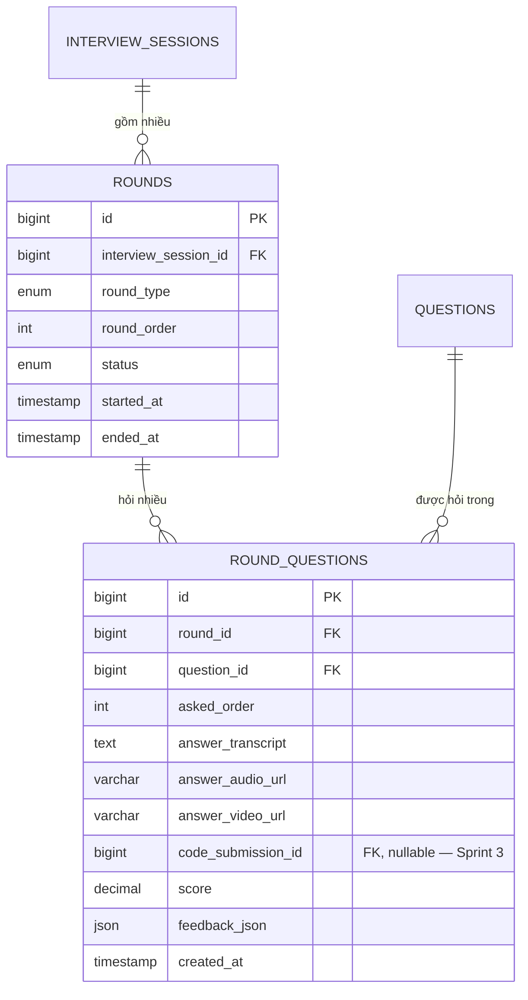

# Thiết kế Data Model — Round Module

> Người phụ trách: Nguyễn Xuân Tùng | Task 13.1 (US-13)
> **Trạng thái: CHỈ THIẾT KẾ trong Sprint 1, chưa migrate/code UI cấu hình**
> (theo đúng ghi chú trong WBS). Dự kiến migrate + implement từ Sprint 2/3
> khi triển khai US-14 (tự động ghép vòng), US-16 (Judge0) và US-17 (follow-up động).

## 1. Mục đích

Một `interview_session` không phải một khối hỏi-đáp phẳng, mà gồm nhiều
**vòng (round)** nối tiếp (Behavioral → Technical Coding → System Design),
mỗi vòng hỏi nhiều câu hỏi lấy từ Question Bank. `rounds` +
`round_questions` là lớp trung gian kết nối **Interview Engine** (State
Machine) với **Question Bank** (đã có ở Sprint 1).

## 2. Sơ đồ quan hệ (mở rộng từ ERD core)



## 3. Giải thích thiết kế

- **`rounds.round_type`**: `BEHAVIORAL | TECHNICAL_CODING | SYSTEM_DESIGN`
  — mỗi loại vòng có rubric chấm điểm khác nhau (proposal mục "Vertical
  thay đổi luồng nghiệp vụ": vòng Coding ưu tiên thuật toán, vòng
  Behavioral ưu tiên STAR + phi ngôn ngữ).
- **`rounds.status`**: `PENDING → IN_PROGRESS → COMPLETED | SKIPPED`,
  là state machine con nằm trong state máy lớn của `interview_sessions`
  (US-19). Khi `rounds.status = COMPLETED` cho vòng cuối, Interview Engine
  sẽ set `interview_sessions.status = COMPLETED`.
- **`round_questions`** là bảng **junction** giữa `rounds` và `questions`
  — không sửa/nhân bản nội dung câu hỏi gốc, chỉ tham chiếu `question_id`,
  giữ Question Bank làm nguồn dữ liệu tập trung (single source of truth)
  đúng như nguyên tắc RAG đã thống nhất khi thiết kế AI.
- **`round_questions.code_submission_id`** để trống (nullable, chưa có
  bảng `code_submissions` — sẽ tạo ở Sprint 3 cùng US-16/Judge0). Thiết
  kế sẵn cột này từ bây giờ để tránh phải sửa schema `round_questions`
  sau này.
- **`round_questions.feedback_json`** lưu output chấm điểm chi tiết từ
  Analysis Engine (điểm STAR, điểm code...) theo từng câu hỏi — độc lập
  với `reports.star_score_json` (tổng hợp toàn phiên).

## 4. SQL nháp (tham khảo cho Sprint 2/3 — KHÔNG chạy migration ở Sprint 1)

```sql
-- DRAFT — tạo changeset Liquibase mới khi triển khai US-14/US-19
CREATE TABLE rounds (
    id                    BIGINT UNSIGNED AUTO_INCREMENT PRIMARY KEY,
    interview_session_id BIGINT UNSIGNED NOT NULL,
    round_type            ENUM('BEHAVIORAL', 'TECHNICAL_CODING', 'SYSTEM_DESIGN') NOT NULL,
    round_order            SMALLINT UNSIGNED NOT NULL,
    status                 ENUM('PENDING', 'IN_PROGRESS', 'COMPLETED', 'SKIPPED')
                               NOT NULL DEFAULT 'PENDING',
    started_at             DATETIME(6) NULL,
    ended_at               DATETIME(6) NULL,
    created_at             DATETIME(6) NOT NULL DEFAULT CURRENT_TIMESTAMP(6),
    updated_at             DATETIME(6) NOT NULL DEFAULT CURRENT_TIMESTAMP(6)
                                       ON UPDATE CURRENT_TIMESTAMP(6),

    CONSTRAINT fk_rounds_session
        FOREIGN KEY (interview_session_id) REFERENCES interview_sessions (id)
        ON DELETE CASCADE ON UPDATE RESTRICT,
    CONSTRAINT uq_round_order UNIQUE (interview_session_id, round_order),
    CONSTRAINT chk_round_order CHECK (round_order > 0),
    CONSTRAINT chk_round_time CHECK (
        ended_at IS NULL OR (started_at IS NOT NULL AND ended_at >= started_at)
    )
) ENGINE=InnoDB DEFAULT CHARSET=utf8mb4 COLLATE=utf8mb4_unicode_ci;

-- DRAFT — đặt cùng changeset tạo rounds hoặc một changeset kế tiếp
CREATE TABLE round_questions (
    id                    BIGINT UNSIGNED AUTO_INCREMENT PRIMARY KEY,
    round_id              BIGINT UNSIGNED NOT NULL,
    question_id           BIGINT UNSIGNED NOT NULL,
    asked_order           SMALLINT UNSIGNED NOT NULL,
    answer_transcript     TEXT NULL,
    answer_audio_url      VARCHAR(500) NULL,
    answer_video_url      VARCHAR(500) NULL,
    code_submission_id    BIGINT UNSIGNED NULL COMMENT 'FK tới code_submissions — tạo ở Sprint 3',
    score                 DECIMAL(4,2) NULL COMMENT 'Thang điểm 0.00 - 10.00',
    feedback_json         JSON NULL,
    created_at            DATETIME(6) NOT NULL DEFAULT CURRENT_TIMESTAMP(6),
    updated_at            DATETIME(6) NOT NULL DEFAULT CURRENT_TIMESTAMP(6)
                                      ON UPDATE CURRENT_TIMESTAMP(6),

    CONSTRAINT fk_rq_round
        FOREIGN KEY (round_id) REFERENCES rounds (id)
        ON DELETE CASCADE ON UPDATE RESTRICT,
    CONSTRAINT fk_rq_question
        FOREIGN KEY (question_id) REFERENCES questions (id)
        ON DELETE RESTRICT ON UPDATE RESTRICT,
    CONSTRAINT uq_round_question_order UNIQUE (round_id, asked_order),
    CONSTRAINT uq_round_question UNIQUE (round_id, question_id),
    CONSTRAINT chk_round_question_order CHECK (asked_order > 0),
    CONSTRAINT chk_round_question_score CHECK (
        score IS NULL OR score BETWEEN 0.00 AND 10.00
    )
) ENGINE=InnoDB DEFAULT CHARSET=utf8mb4 COLLATE=utf8mb4_unicode_ci;
```

## 5. Việc cần làm ở Sprint sau (không làm ở Sprint 1)
- Tạo `code_submissions` (Sprint 3, cùng US-16/Judge0).
- Thêm entity/repository JPA tương ứng trong package `interview/`.
- Thiết kế API `POST /interview-sessions/{id}/rounds/{roundId}/answer`.
