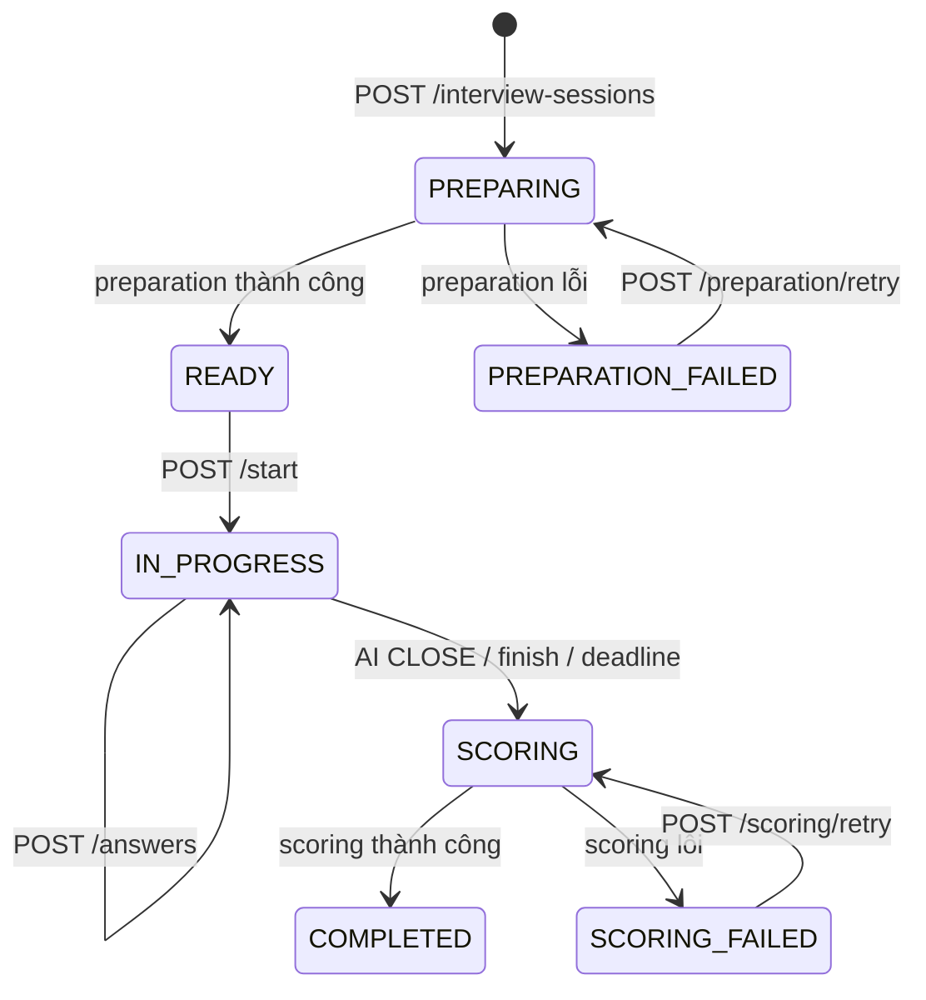

# Interview Session API

Tài liệu này bao trọn vòng đời một buổi phỏng vấn: chọn option → chuẩn bị bằng AI → hội thoại → kết thúc → chấm điểm → report.



`CANCELLED` và `EXPIRED` có trong enum nhưng hiện không có endpoint/transition public tạo ra hai state này. Frontend vẫn nên parse chúng như terminal fallback.

Mọi endpoint yêu cầu Bearer token và chỉ owner của session truy cập được.

## TypeScript contract

```ts
type InterviewerStyle = "FRIENDLY" | "PROFESSIONAL" | "CHALLENGING";
type InterviewSessionStatus =
  | "PREPARING"
  | "READY"
  | "PREPARATION_FAILED"
  | "IN_PROGRESS"
  | "SCORING"
  | "COMPLETED"
  | "SCORING_FAILED"
  | "CANCELLED"
  | "EXPIRED";
type InterviewEndReason =
  | "AI_COMPLETED"
  | "TIME_EXPIRED"
  | "CANDIDATE_FINISHED"
  | "SYSTEM_TERMINATED";
type InterviewTurnRole = "INTERVIEWER" | "CANDIDATE";
type InterviewTurnAction = "OPENING" | "EXPLORE" | "FOLLOW_UP" | "HANDLE_REQUEST" | "CLOSE";
type CandidateIntent =
  | "ANSWER" | "REQUEST_REPEAT" | "REQUEST_CLARIFICATION" | "REQUEST_TIME"
  | "ASK_INTERVIEWER" | "CANNOT_ANSWER" | "DECLINE_OR_SKIP"
  | "CORRECT_PREVIOUS_ANSWER" | "REQUEST_END" | "SOCIAL_OR_META"
  | "OFF_TOPIC" | "INAPPROPRIATE" | "OTHER";
type TurnProcessingStatus = "PROCESSING" | "COMPLETED" | "FAILED";

interface InterviewSessionOptions {
  languages: Array<{ code: string; name: string }>;
  durations: number[];
  interviewerStyles: Array<{ code: InterviewerStyle; name: string }>;
}

interface InterviewSessionStatusResponse {
  id: number;
  status: InterviewSessionStatus;
  templateTitle: string;
  profileName: string;
  languageCode: string;
  durationMinutes: number;
  interviewerStyle: InterviewerStyle;
  preparationErrorCode: string | null;
  preparationErrorMessage: string | null;
  scoringErrorCode: string | null;
  scoringErrorMessage: string | null;
  preparedAt: string | null;
  endReason: InterviewEndReason | null;
  endedAt: string | null;
  completedAt: string | null;
}

interface InterviewTurn {
  id: number;
  turnIndex: number;
  role: InterviewTurnRole;
  content: string;
  candidateIntent: CandidateIntent | null;
  action: InterviewTurnAction | null;
  focusAreaCode: string | null;
  requestId: string | null;
  processingStatus: TurnProcessingStatus | null;
  processingErrorCode: string | null;
  createdAt: string;
}

interface InterviewConversation {
  sessionId: number;
  status: InterviewSessionStatus;
  startedAt: string | null;
  deadlineAt: string | null;
  endReason: InterviewEndReason | null;
  endedAt: string | null;
  remainingSeconds: number;
  currentTurnIndex: number;
  turns: InterviewTurn[];
}

interface InterviewAnswerResponse {
  sessionId: number;
  status: InterviewSessionStatus;
  deadlineAt: string | null;
  endReason: InterviewEndReason | null;
  endedAt: string | null;
  remainingSeconds: number;
  currentTurnIndex: number;
  candidateTurn: InterviewTurn | null;
  interviewerTurn: InterviewTurn | null;
}
```

## 1. Lấy option từ server

```http
GET /api/interview-session-options
Authorization: Bearer <accessToken>
```

```json
{
  "languages": [
    { "code": "vi", "name": "Tiếng Việt" },
    { "code": "en", "name": "English" }
  ],
  "durations": [15, 30, 45, 60],
  "interviewerStyles": [
    { "code": "FRIENDLY", "name": "Thân thiện" },
    { "code": "PROFESSIONAL", "name": "Chuyên nghiệp" },
    { "code": "CHALLENGING", "name": "Thử thách" }
  ]
}
```

Giá trị lấy từ config server; không hard-code danh sách để submit. `FRIENDLY` có giọng khuyến khích, `PROFESSIONAL` trung tính/có cấu trúc, `CHALLENGING` hỏi trực diện về claim và trade-off.

## 2. Tạo session và chuẩn bị plan

```http
POST /api/interview-sessions
Authorization: Bearer <accessToken>
Idempotency-Key: 01991f7e-a4d4-7fb9-ae21-57989102fe04
Content-Type: application/json

{
  "templateId": 101,
  "profileId": 35,
  "languageCode": "vi",
  "durationMinutes": 30,
  "interviewerStyle": "PROFESSIONAL"
}
```

Điều kiện:

- Profile thuộc user, CV còn active và profile đã confirm.
- Template đã confirm, chưa archive, đồng thời thuộc user hoặc đang published.
- Language/duration/style thuộc response options.
- `templateId`, `profileId` là số dương.
- `Idempotency-Key` bắt buộc, không rỗng, tối đa 100 ký tự.

Response luôn `202 Accepted` với `InterviewSessionStatusResponse`:

```json
{
  "id": 501,
  "status": "PREPARING",
  "templateTitle": "Java Backend Developer",
  "profileName": "Backend profile 2026",
  "languageCode": "vi",
  "durationMinutes": 30,
  "interviewerStyle": "PROFESSIONAL",
  "preparationErrorCode": null,
  "preparationErrorMessage": null,
  "scoringErrorCode": null,
  "scoringErrorMessage": null,
  "preparedAt": null,
  "endReason": null,
  "endedAt": null,
  "completedAt": null
}
```

Backend snapshot toàn bộ profile và template ngay khi tạo. Edit/unpublish/xóa nguồn sau đó không thay đổi session này.

Cùng user + cùng idempotency key + cùng năm option trả session cũ và không dispatch preparation lần nữa. Dùng key cũ với payload khác trả `409 INTERVIEW_SESSION_IDEMPOTENCY_CONFLICT`.

Lỗi eligibility: `TEMPLATE_NOT_FOUND`, `TEMPLATE_ARCHIVED`, `TEMPLATE_CONFIRM_REQUIRED`, `PROFILE_NOT_FOUND`, `PROFILE_CONFIRM_REQUIRED`, `INTERVIEW_SESSION_OPTION_INVALID`, `VALIDATION_FAILED`.

## 3. Poll preparation

```http
GET /api/interview-sessions/{sessionId}
Authorization: Bearer <accessToken>
```

| Status | UI/action |
|---|---|
| `PREPARING` | Progress, poll tiếp |
| `READY` | Dừng poll, bật nút Start |
| `PREPARATION_FAILED` | Dừng, hiện error + Retry |
| State khác | Điều hướng theo state machine |

Response status cố ý không trả opening message, focus area hoặc AI context. Các dữ liệu đó là nội bộ.

Retry:

```http
POST /api/interview-sessions/{sessionId}/preparation/retry
Authorization: Bearer <accessToken>
```

Response `202 InterviewSessionStatusResponse`. Chỉ `PREPARATION_FAILED` được retry; state khác trả `409 INTERVIEW_SESSION_PREPARATION_NOT_RETRYABLE`. Backend xóa plan dở dang và dùng lại snapshot/options gốc. Worker có thể hoàn tất trước khi response được đọc.

## 4. Start interview

```http
POST /api/interview-sessions/{sessionId}/start
Authorization: Bearer <accessToken>
```

Chỉ `READY` được start. Backend atomically đổi sang `IN_PROGRESS`, đặt `startedAt`, `deadlineAt = startedAt + duration`, và lưu opening message thành interviewer turn `0`.

Gọi lại khi đã `IN_PROGRESS` là idempotent và trả conversation hiện tại, không reset timer. State khác trả `409 INTERVIEW_SESSION_NOT_STARTABLE`.

```json
{
  "sessionId": 501,
  "status": "IN_PROGRESS",
  "startedAt": "2026-09-07T08:10:00Z",
  "deadlineAt": "2026-09-07T08:40:00Z",
  "endReason": null,
  "endedAt": null,
  "remainingSeconds": 1800,
  "currentTurnIndex": 0,
  "turns": [
    {
      "id": 9001,
      "turnIndex": 0,
      "role": "INTERVIEWER",
      "content": "Xin chào, chúng ta bắt đầu nhé...",
      "candidateIntent": null,
      "action": "OPENING",
      "focusAreaCode": null,
      "requestId": null,
      "processingStatus": null,
      "processingErrorCode": null,
      "createdAt": "2026-09-07T08:10:00Z"
    }
  ]
}
```

Countdown UI lấy `deadlineAt` làm nguồn sự thật: `max(0, deadlineAt - Date.now())`. `remainingSeconds` là snapshot tại lúc response, không giảm tự động.

## 5. Submit answer

```http
POST /api/interview-sessions/{sessionId}/answers
Authorization: Bearer <accessToken>
Idempotency-Key: 01991f7e-a4d4-7fb9-ae21-57989102fe05
Content-Type: application/json

{
  "expectedTurnIndex": 0,
  "answer": "Tôi đã xây dựng REST API bằng Spring Boot..."
}
```

- `expectedTurnIndex` là index của **interviewer turn đang được trả lời**, không phải index candidate sắp tạo.
- `answer` sau trim phải còn nội dung, tối đa 8.000 ký tự.
- Mỗi answer mới dùng UUID mới. Retry cùng answer dùng lại key, `expectedTurnIndex` và text y hệt sau trim.
- Endpoint chờ AI đồng bộ. UI phải disable submit cho đến khi request kết thúc hoặc state được reconcile.

Index bình thường: interviewer `0` → candidate `1` → interviewer `2` → candidate `3`...

Response thành công:

```json
{
  "sessionId": 501,
  "status": "IN_PROGRESS",
  "deadlineAt": "2026-09-07T08:40:00Z",
  "endReason": null,
  "endedAt": null,
  "remainingSeconds": 1640,
  "currentTurnIndex": 2,
  "candidateTurn": {
    "id": 9002,
    "turnIndex": 1,
    "role": "CANDIDATE",
    "content": "Tôi đã xây dựng REST API bằng Spring Boot...",
    "candidateIntent": "ANSWER",
    "action": null,
    "focusAreaCode": null,
    "requestId": "01991f7e-a4d4-7fb9-ae21-57989102fe05",
    "processingStatus": "COMPLETED",
    "processingErrorCode": null,
    "createdAt": "2026-09-07T08:12:30Z"
  },
  "interviewerTurn": {
    "id": 9003,
    "turnIndex": 2,
    "role": "INTERVIEWER",
    "content": "Bạn đã xử lý authentication như thế nào?",
    "candidateIntent": null,
    "action": "FOLLOW_UP",
    "focusAreaCode": "BACKEND",
    "requestId": null,
    "processingStatus": null,
    "processingErrorCode": null,
    "createdAt": "2026-09-07T08:12:36Z"
  }
}
```

Nếu AI trả action `CLOSE`, response có interviewer closing turn và status đã là `SCORING`; không render ô nhập tiếp.

### Idempotency và khôi phục answer

Backend lưu candidate turn **trước** khi gọi AI:

- Retry key đã `COMPLETED`: trả candidate/reply đã lưu, không gọi AI lại.
- Key đang `PROCESSING` dưới 60 giây: `409 INTERVIEW_TURN_PROCESSING` để chặn gọi AI song song.
- Key `FAILED`, hoặc `PROCESSING` stale từ 60 giây: cùng key + payload được phép gọi AI lại.
- Cùng key nhưng text/turn khác: `409 INTERVIEW_TURN_IDEMPOTENCY_CONFLICT`.
- `expectedTurnIndex` không còn đúng: `409 INTERVIEW_TURN_OUT_OF_SEQUENCE`.

Khi request timeout/mất mạng:

1. Không tạo key mới.
2. Gọi `GET /conversation`.
3. Nếu candidate turn theo `requestId` đã `COMPLETED`, dùng dữ liệu server.
4. Nếu `FAILED`, submit lại cùng key/body.
5. Nếu `PROCESSING`, chờ và fetch lại; retry cùng key sau khi stale nếu cần.

Khi AI request ném lỗi, HTTP answer có thể trả lỗi `AI_TIMEOUT`, `AI_SERVICE_UNAVAILABLE`, `AI_ERROR` hoặc lỗi validation AI; candidate turn vẫn tồn tại với `processingStatus: FAILED` và `processingErrorCode`. Không rollback optimistic message khỏi UI trước khi reconcile conversation.

## 6. Resume conversation

```http
GET /api/interview-sessions/{sessionId}/conversation
Authorization: Bearer <accessToken>
```

Trả toàn bộ turn theo `turnIndex ASC`, timer và state hiện tại. Gọi endpoint này khi mở/reload interview screen, answer request không chắc kết quả, reconnect mạng hoặc cần reconcile optimistic UI.

Candidate turn có `requestId`, `processingStatus`; interviewer turn có `action`, `focusAreaCode`. `candidateIntent` chỉ có sau khi AI xử lý thành công.

Scheduler quét deadline theo chu kỳ config mặc định 30 giây. Có thể có khoảng ngắn `remainingSeconds = 0` nhưng status còn `IN_PROGRESS`; frontend khóa input khi countdown về 0 và fetch lại. Submit sau deadline cũng khiến backend chuyển session sang `SCORING` mà không lưu answer mới.

## 7. Finish sớm

```http
POST /api/interview-sessions/{sessionId}/finish
Authorization: Bearer <accessToken>
```

Khi `IN_PROGRESS`, backend chuyển sang `SCORING`, `endReason=CANDIDATE_FINISHED`, không thêm interviewer turn giả. Gọi lại ở `SCORING` hoặc `COMPLETED` là idempotent; state khác trả `409 INTERVIEW_SESSION_NOT_IN_PROGRESS`.

Response là `InterviewConversation` và luôn có toàn bộ history. End reason:

| Value | Nguồn |
|---|---|
| `AI_COMPLETED` | AI chủ động `CLOSE` |
| `CANDIDATE_FINISHED` | User gọi finish hoặc AI nhận intent `REQUEST_END` rồi `CLOSE` |
| `TIME_EXPIRED` | Deadline trong answer flow hoặc scheduler |
| `SYSTEM_TERMINATED` | Dành cho hệ thống; chưa có endpoint public |

## 8. Poll scoring và lấy report

Chỉ gọi report khi status đã là `SCORING`, `SCORING_FAILED` hoặc `COMPLETED`:

```http
GET /api/interview-sessions/{sessionId}/report
Authorization: Bearer <accessToken>
```

Khi đang scoring:

```json
{
  "sessionId": 501,
  "status": "SCORING",
  "scoringErrorCode": null,
  "scoringErrorMessage": null,
  "technicalScore": null,
  "communicationScore": null,
  "overallScore": null,
  "coveragePercentage": null,
  "confidence": null,
  "overallSummary": null,
  "strengths": [],
  "improvements": [],
  "actionPlan": [],
  "communicationFeedback": null,
  "focusAreas": [],
  "completedAt": null
}
```

Khi thất bại cùng shape, status `SCORING_FAILED`, có `scoringErrorCode` và `scoringErrorMessage`. Dừng poll và hiện Retry.

Khi hoàn tất:

```json
{
  "sessionId": 501,
  "status": "COMPLETED",
  "scoringErrorCode": null,
  "scoringErrorMessage": null,
  "technicalScore": 75.00,
  "communicationScore": 70.00,
  "overallScore": 74.00,
  "coveragePercentage": 100.00,
  "confidence": "HIGH",
  "overallSummary": "Ứng viên có nền tảng backend tốt.",
  "strengths": [
    { "title": "Backend fundamentals", "description": "Giải thích được một REST API cụ thể.", "evidenceTurnIds": [9002] }
  ],
  "improvements": [],
  "actionPlan": [
    { "priority": 1, "action": "Luyện system design", "reason": "Phần trade-off còn ngắn", "suggestion": "Thiết kế một service và ghi rõ bottleneck" }
  ],
  "communicationFeedback": "Câu trả lời rõ ràng và liên quan.",
  "focusAreas": [
    {
      "focusAreaId": 21,
      "code": "BACKEND",
      "name": "Backend",
      "priority": "HIGH",
      "displayOrder": 0,
      "score": 75.00,
      "confidence": "HIGH",
      "evidenceStatus": "SUFFICIENT",
      "rationale": "Ứng viên mô tả implementation cụ thể.",
      "strengths": ["Hiểu Spring Boot"],
      "gaps": ["Chưa định lượng production impact"],
      "feedback": "Bổ sung outcome đo được.",
      "evidenceTurnIds": [9002]
    }
  ],
  "completedAt": "2026-09-07T08:29:00Z"
}
```

```ts
type AssessmentConfidence = "LOW" | "MEDIUM" | "HIGH";
type EvidenceStatus = "NOT_EXPLORED" | "PARTIAL" | "SUFFICIENT";

interface InterviewReport {
  sessionId: number;
  status: "SCORING" | "SCORING_FAILED" | "COMPLETED";
  scoringErrorCode: string | null;
  scoringErrorMessage: string | null;
  technicalScore: number | null;
  communicationScore: number | null;
  overallScore: number | null;
  coveragePercentage: number | null;
  confidence: AssessmentConfidence | null;
  overallSummary: string | null;
  strengths: Array<{ title: string; description: string; evidenceTurnIds: number[] }>;
  improvements: Array<{ title: string; description: string; evidenceTurnIds: number[] }>;
  actionPlan: Array<{ priority: number; action: string; reason: string; suggestion: string }>;
  communicationFeedback: string | null;
  focusAreas: Array<{
    focusAreaId: number; code: string; name: string;
    priority: "HIGH" | "MEDIUM" | "LOW"; displayOrder: number;
    score: number | null; confidence: AssessmentConfidence; evidenceStatus: EvidenceStatus;
    rationale: string; strengths: string[]; gaps: string[]; feedback: string;
    evidenceTurnIds: number[];
  }>;
  completedAt: string | null;
}
```

Backend tính aggregate:

- Priority weight: `HIGH=3`, `MEDIUM=2`, `LOW=1`.
- Coverage factor: `NOT_EXPLORED=0`, `PARTIAL=0.5`, `SUFFICIENT=1`.
- Technical score là weighted mean các focus area có score.
- Overall mặc định = `technical * 0.8 + communication * 0.2`.
- Nếu coverage dưới ngưỡng config (mặc định hiện tại 50%), `overallScore=null` và confidence `LOW`; feedback theo area vẫn có.

UI coi `overallScore: null` là “chưa đủ evidence”, không hiển thị thành 0.

## 9. Retry scoring

```http
POST /api/interview-sessions/{sessionId}/scoring/retry
Authorization: Bearer <accessToken>
```

Response `202 InterviewReport` với status `SCORING`. Chỉ `SCORING_FAILED` được retry; state khác trả `409 INTERVIEW_SCORING_NOT_RETRYABLE`. Tiếp tục poll report sau response.

## Error code theo phase

| Phase | Code chính |
|---|---|
| Create | `INTERVIEW_SESSION_OPTION_INVALID`, `INTERVIEW_SESSION_IDEMPOTENCY_CONFLICT`, template/profile errors |
| Preparation | `INTERVIEW_SESSION_PREPARATION_FAILED`, `INTERVIEW_SESSION_PREPARATION_NOT_RETRYABLE`, `AI_*` trong status |
| Start | `INTERVIEW_SESSION_NOT_STARTABLE` |
| Answer | `INTERVIEW_SESSION_NOT_IN_PROGRESS`, `INTERVIEW_TURN_OUT_OF_SEQUENCE`, `INTERVIEW_TURN_IDEMPOTENCY_CONFLICT`, `INTERVIEW_TURN_PROCESSING`, `AI_*` |
| Report | `INTERVIEW_REPORT_NOT_AVAILABLE`, `INTERVIEW_SCORING_FAILED`, `INTERVIEW_SCORING_NOT_RETRYABLE` |
| Mọi phase | `INTERVIEW_SESSION_NOT_FOUND`, auth/common errors |

