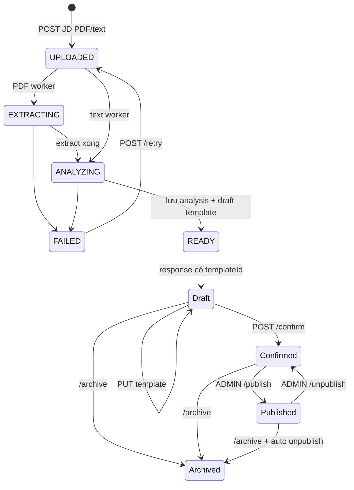

# Job Description + Interview Template API

JD và Interview Template là một luồng sản phẩm. JD là input nguồn; backend extract/analyze bằng AI rồi tự tạo đúng một template draft. Frontend không có API tạo template trực tiếp.



Tất cả endpoint yêu cầu Bearer token. JD thuộc riêng owner. Template detail đọc được nếu là owner hoặc template đang public; mọi mutation template yêu cầu owner. Publish/unpublish còn yêu cầu role `ADMIN`.

## TypeScript contract

```ts
type JobDescriptionSourceType = "FILE" | "TEXT";
type JobDescriptionStatus =
  | "UPLOADED"
  | "EXTRACTING"
  | "ANALYZING"
  | "READY"
  | "FAILED";
type JobDescriptionFailureStage = "DISPATCH" | "EXTRACTION" | "ANALYSIS";
type SkillLevel = "MUST_HAVE" | "NICE_TO_HAVE";

interface JobAnalysis {
  sufficientJobContext: boolean;
  sourceLanguage: string;
  jobTitle: string | null;
  targetSeniority: string | null;
  domain: string | null;
  summary: string;
  keySkills: Array<{
    name: string;
    level: SkillLevel;
    description: string | null;
  }>;
}

interface JobDescription {
  id: number;
  sourceType: JobDescriptionSourceType;
  originalFilename: string;
  contentType: string;
  fileSizeBytes: number;
  status: JobDescriptionStatus;
  errorCode: string | null;
  failureStage: JobDescriptionFailureStage | null;
  statusMessage: string | null;
  uploadedAt: string;
  processedAt: string | null;
  templateId: number | null;
  templateConfirmed: boolean;
  templateTitle: string | null;
}

interface JobDescriptionAnalysisResponse {
  jobDescriptionId: number;
  extractedText: string;
  analysis: JobAnalysis;
  schemaVersion: string;
  modelName: string;
  durationMs: number;
  tokenCount: number | null;
  createdAt: string;
}

interface InterviewTemplateSummary {
  id: number;
  sourceJobDescriptionId: number;
  title: string;
  jobTitle: string | null;
  targetSeniority: string | null;
  confirmed: boolean;
  published: boolean;
  archivedAt: string | null;
  updatedAt: string;
}

interface InterviewTemplate extends InterviewTemplateSummary {
  content: JobAnalysis;
  confirmedAt: string | null;
  publishedAt: string | null;
  version: number;
  createdAt: string;
}

interface PageResponse<T> {
  content: T[];
  page: number;
  size: number;
  totalElements: number;
}
```

## 1A. Tạo từ JD PDF

```http
POST /api/job-descriptions
Authorization: Bearer <accessToken>
Content-Type: multipart/form-data

file=<PDF binary>
```

Input hiện tại:

- Tên `.pdf`, PDF magic bytes hợp lệ, mở được, không encrypted.
- Tối đa 5 MiB (`5,242,880` bytes) và 20 trang.
- Một user giữ tối đa 50 JD active.

Không tự đặt `Content-Type` khi dùng browser `FormData`.

## 1B. Tạo từ JD text

Cùng path nhưng content type khác:

```http
POST /api/job-descriptions
Authorization: Bearer <accessToken>
Content-Type: application/json

{
  "title": "Java Backend Developer",
  "text": "We are looking for a Java developer..."
}
```

`title` bắt buộc, tối đa 200 ký tự. `text` bắt buộc, sau trim tối đa 30.000 ký tự theo config mặc định. Backend dùng tên `${title}.txt` trong metadata nhưng không tạo file download cho text input.

## Response tạo JD và deduplication

Cả hai cách trả cùng `JobDescription`:

```json
{
  "id": 88,
  "sourceType": "TEXT",
  "originalFilename": "Java Backend Developer.txt",
  "contentType": "text/plain",
  "fileSizeBytes": 1540,
  "status": "UPLOADED",
  "errorCode": null,
  "failureStage": null,
  "statusMessage": null,
  "uploadedAt": "2026-09-07T08:00:00Z",
  "processedAt": null,
  "templateId": null,
  "templateConfirmed": false,
  "templateTitle": null
}
```

- `202 Accepted`: tạo pipeline mới.
- `200 OK`: cùng owner đã có JD cùng checksum ở `READY`, template còn draft và chưa archive. Backend tái sử dụng JD + template; nếu JD từng soft-delete thì active lại.
- JD trùng nhưng template đã confirm/archived không được reuse; backend tạo JD/template mới để có draft mới.

Worker có thể đổi status trước khi response được đọc. Luôn dùng status thực tế trong body.

Lỗi input: `JD_FILE_REQUIRED`, `JD_INVALID_FILE_TYPE`, `JD_FILE_TOO_LARGE`, `JD_FILE_CORRUPTED`, `JD_TOO_MANY_PAGES`, `JD_TEXT_TOO_LONG`, `JD_LIMIT_REACHED`, `STORAGE_UNAVAILABLE`, `VALIDATION_FAILED`.

## 2. Poll JD đến khi có Template

```http
GET /api/job-descriptions/{id}
Authorization: Bearer <accessToken>
```

| Status | Ý nghĩa | UI/action |
|---|---|---|
| `UPLOADED` | Đã nhận, chờ worker | Poll tiếp |
| `EXTRACTING` | Đang extract PDF | Poll tiếp |
| `ANALYZING` | Đang gọi AI | Poll tiếp |
| `READY` | Đã lưu analysis và draft | Dừng; mở `templateId` |
| `FAILED` | Pipeline lỗi | Dừng; hiện error và retry |

`failureStage` cho biết lỗi xảy ra ở `DISPATCH`, `EXTRACTION` hay `ANALYSIS`; `errorCode` là code máy đọc và `statusMessage` là fallback cho người dùng.

Khi hoàn tất:

```json
{
  "id": 88,
  "sourceType": "TEXT",
  "originalFilename": "Java Backend Developer.txt",
  "contentType": "text/plain",
  "fileSizeBytes": 1540,
  "status": "READY",
  "errorCode": null,
  "failureStage": null,
  "statusMessage": null,
  "uploadedAt": "2026-09-07T08:00:00Z",
  "processedAt": "2026-09-07T08:00:08Z",
  "templateId": 101,
  "templateConfirmed": false,
  "templateTitle": "Java Backend Developer"
}
```

`GET /api/job-descriptions` trả `JobDescription[]`, mới nhất trước, chỉ gồm JD active. Dùng để resume polling sau reload.

## 3. Retry JD thất bại

```http
POST /api/job-descriptions/{id}/retry
Authorization: Bearer <accessToken>
```

Response `202 JobDescription`. Chỉ `FAILED` được retry. Pipeline đang chạy trả `409 JD_PROCESSING_IN_PROGRESS`; `READY` trả `409 JD_PROCESSING_NOT_RETRYABLE`. Sau retry poll lại detail.

## 4. Đọc nguồn và AI analysis

Với PDF:

```http
GET /api/job-descriptions/{id}/file
Authorization: Bearer <accessToken>
```

Trả `{ "url": "...", "expiresAt": "..." }`, URL sống 5 phút. JD text trả `409 JD_FILE_NOT_AVAILABLE`.

Khi JD `READY`:

```http
GET /api/job-descriptions/{id}/analysis
Authorization: Bearer <accessToken>
```

```json
{
  "jobDescriptionId": 88,
  "extractedText": "We are looking for...",
  "analysis": {
    "sufficientJobContext": true,
    "sourceLanguage": "en",
    "jobTitle": "Java Backend Developer",
    "targetSeniority": "JUNIOR",
    "domain": "E-commerce",
    "summary": "Build and maintain backend services.",
    "keySkills": [
      {
        "name": "Java",
        "level": "MUST_HAVE",
        "description": "Strong Java fundamentals"
      }
    ]
  },
  "schemaVersion": "v1",
  "modelName": "configured-model",
  "durationMs": 7210,
  "tokenCount": null,
  "createdAt": "2026-09-07T08:00:08Z"
}
```

Analysis là bản AI gốc, bất biến; user chỉ sửa `template.content`. Trước khi sẵn sàng endpoint trả `409 JD_ANALYSIS_NOT_READY`.

## 5. List và đọc Template

```http
GET /api/interview-templates?scope=mine&page=0&size=20
Authorization: Bearer <accessToken>
```

- `scope=mine`: mọi template của user, kể cả archived và chưa confirm.
- `scope=public`: template đang published và chưa archived của mọi user.
- `page` bắt đầu từ 0; `size` từ 1 đến 100; sort `createdAt DESC, id DESC`.
- Scope khác trả `400 VALIDATION_FAILED`.

```json
{
  "content": [
    {
      "id": 101,
      "sourceJobDescriptionId": 88,
      "title": "Java Backend Developer",
      "jobTitle": "Java Backend Developer",
      "targetSeniority": "JUNIOR",
      "confirmed": false,
      "published": false,
      "archivedAt": null,
      "updatedAt": "2026-09-07T08:00:08Z"
    }
  ],
  "page": 0,
  "size": 20,
  "totalElements": 1
}
```

Summary không có `version`. Trước mọi mutation phải gọi:

```http
GET /api/interview-templates/{templateId}
Authorization: Bearer <accessToken>
```

Owner đọc được template kể cả draft/archived. Người khác chỉ đọc được khi đang published và chưa archived; nếu không trả `404 TEMPLATE_NOT_FOUND`.

```json
{
  "id": 101,
  "sourceJobDescriptionId": 88,
  "title": "Java Backend Developer",
  "jobTitle": "Java Backend Developer",
  "targetSeniority": "JUNIOR",
  "content": {
    "sufficientJobContext": true,
    "sourceLanguage": "en",
    "jobTitle": "Java Backend Developer",
    "targetSeniority": "JUNIOR",
    "domain": "E-commerce",
    "summary": "Build and maintain backend services.",
    "keySkills": [
      {
        "name": "Java",
        "level": "MUST_HAVE",
        "description": "Strong Java fundamentals"
      }
    ]
  },
  "confirmed": false,
  "confirmedAt": null,
  "published": false,
  "publishedAt": null,
  "archivedAt": null,
  "version": 0,
  "createdAt": "2026-09-07T08:00:08Z",
  "updatedAt": "2026-09-07T08:00:08Z"
}
```

## 6. Update draft Template

```http
PUT /api/interview-templates/{templateId}
Authorization: Bearer <accessToken>
Content-Type: application/json

{
  "title": "Java Backend — Junior",
  "content": {
    "sufficientJobContext": true,
    "sourceLanguage": "vi",
    "jobTitle": "Java Backend Developer",
    "targetSeniority": "JUNIOR",
    "domain": "E-commerce",
    "summary": "Phát triển backend cho hệ thống thương mại điện tử.",
    "keySkills": [
      {
        "name": "Java",
        "level": "MUST_HAVE",
        "description": "Java core và collections"
      },
      {
        "name": "Docker",
        "level": "NICE_TO_HAVE",
        "description": null
      }
    ]
  },
  "expectedVersion": 0
}
```

Đây là replacement của toàn bộ `content`. Response `200 InterviewTemplate`; thay cache bằng response và version mới.

Validation:

| Field | Rule |
|---|---|
| `title` | Bắt buộc, tối đa 200 |
| `expectedVersion` | Bắt buộc, `>= 0`, phải bằng `version` hiện tại |
| `sufficientJobContext` | Phải là `true` |
| `sourceLanguage` | Bắt buộc, tối đa 20 |
| `jobTitle` | Tùy chọn, tối đa 150 |
| `targetSeniority` | Tùy chọn, tối đa 100; hiện là string |
| `domain` | Tùy chọn, tối đa 150 |
| `summary` | Bắt buộc, tối đa 3000 |
| `keySkills` | 1–30 item, tên không trùng khi bỏ qua hoa/thường và trim |
| `keySkills[].name` | Bắt buộc, tối đa 150 |
| `keySkills[].level` | `MUST_HAVE` hoặc `NICE_TO_HAVE` |
| `keySkills[].description` | Tùy chọn, tối đa 1000 |

Lỗi: `409 TEMPLATE_VERSION_CONFLICT`, `409 TEMPLATE_ALREADY_CONFIRMED`, `409 TEMPLATE_ARCHIVED`, `422 TEMPLATE_INVALID_ANALYSIS`, `422 TEMPLATE_INSUFFICIENT_JD`, `404 TEMPLATE_NOT_FOUND`.

## 7. Confirm Template

```http
POST /api/interview-templates/{templateId}/confirm
Authorization: Bearer <accessToken>
Content-Type: application/json

{ "expectedVersion": 1 }
```

Confirm đặt `confirmedAt`, tăng version và khóa update nội dung. Template confirmed, chưa archive có thể dùng tạo session nếu thuộc user; published template có thể được user khác dùng.

Gọi confirm lại là idempotent: trả template hiện tại kể cả `expectedVersion` đã cũ. Không có API unconfirm hoặc clone; muốn sửa nội dung sau confirm phải gửi lại JD để tạo draft mới.

## 8. Publish, unpublish và archive

Các request cùng body:

```json
{ "expectedVersion": 2 }
```

| Endpoint | Điều kiện | Hành vi |
|---|---|---|
| `POST /{id}/publish` | Owner role `ADMIN`, active, confirmed | Đặt `publishedAt`; gọi lại idempotent |
| `POST /{id}/unpublish` | Owner role `ADMIN`, active | Xóa `publishedAt`; gọi lại idempotent |
| `POST /{id}/archive` | Owner, chưa archive | Đặt `archivedAt` và tự unpublish; gọi lại idempotent |

Với thao tác chưa được áp dụng, `expectedVersion` phải khớp. Khi state đã đúng, backend trả state hiện tại trước khi check version. Archive hiện không có API hoàn tác.

## 9. Xóa JD và tác động lên Template

```http
DELETE /api/job-descriptions/{id}
Authorization: Bearer <accessToken>
```

Response `204 No Content`. Không xóa được khi pipeline đang chạy (`409 JD_PROCESSING_IN_PROGRESS`). Đây là soft delete JD khỏi list; template đã tạo **không bị xóa/archive** và vẫn có thể quản lý hoặc dùng theo state của template. Presigned URL PDF vẫn có thể lấy bằng ID đã biết. UI nên coi xóa JD là ẩn source item, không phải xóa template.

